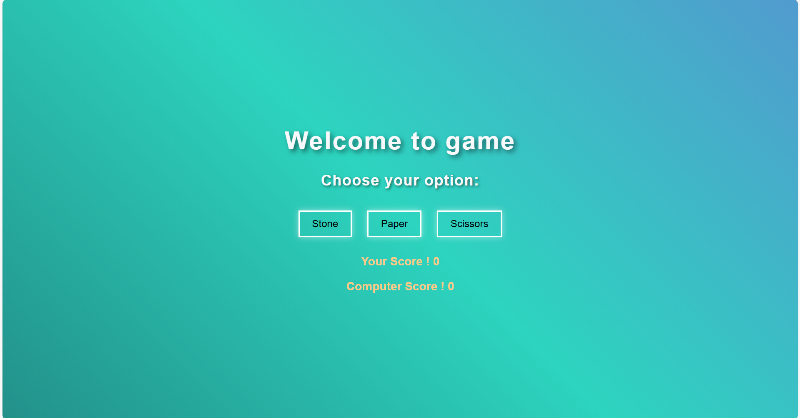

# 🪨📄✂️ Stone Paper Scissors Game

A fun and interactive web-based *Stone Paper Scissors* game built using **HTML**, **CSS**, and **JavaScript**.

## 🌐 Live Demo 
- 🎮 [Neocities Version](https://mahesh123.neocities.org/game/stone_paper_scissor)  
- 🚀 [GitHub Pages Version](https://maheshwaran6953.github.io/stone-paper-scissors/)

## ✨ Features
- Responsive design with clean UI
- Emoji-based animations
- Simple game logic with neat transitions
- Hosted live via **Neocities**

## 📸 Screenshot  
- 

## 🛠️ Built With
- HTML5
- CSS3 (with animations!)
- JavaScript (vanilla)

## 🚀 Getting Started
To run locally:
1. Clone the repo:
   ```bash
   git clone https://github.com/your-maheshwaran6953/stone-paper-scissors.git
